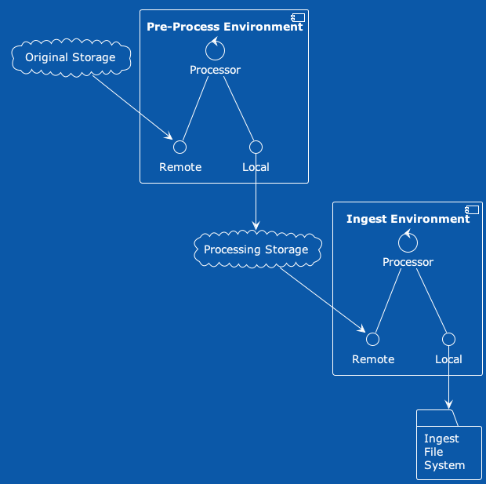
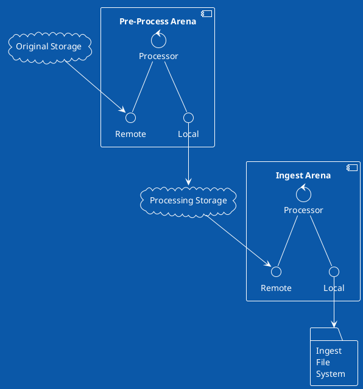
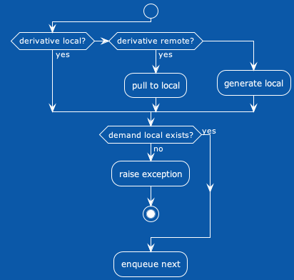
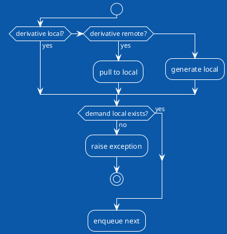

# Derivative::Rodeo

Welcome to the rodeo!  The goal of `Derivative::Rodeo` is to provide interfaces and processing for files.

The conceptual logic of `Derivative::Rodeo` is:

- Use the file I have locally…
- Else pull to local the file from a remote source…
- Else generate a local version…
- Demand a local copy of the file and proceed to the next step.

The above is encoded in [Derivative::Rodeo::Process](./lib/derivative/rodeo/process.rb).

We start from a [Derivative::Rodeo::Manifest::Original](./lib/derivative/rodeo/manifest/original.rb), which is comprised of:

- a parent identifier
- an original filename
- a set of named derivatives; each named derivative might have path to a "known" already extisting file.

We process the original manifest in an [Arena](./lib/derivative/rodeo/arena.rb).  During processing we might spawn multiple "child" processes from one derivative.  For example splitting a PDF into one image per page.  Each of those page images would then have their own [Derivative::Rodeo::Manifest::Derived](./lib/derivative/rodeo/manifest/derived.rb) for further processing.

## Design Goals

`Derivative::Rodeo` is designed in such a way that it can run within an application or as part of a distributed architecture (e.g. AWS Lambdas).  Further, it is designed for extension and configuration; through well-documented interfaces and modular boundaries.

It is also designed to provide insight into configuration and failures through custom exceptions and logging.  It has a fail early mindset; first verifying that the desired derivatives don't creat circular dependencies; flattening those dependencies into a chain which we process one link at a time, via [Derivative::Rodeo::Process](./lib/derivative/rodeo/process.rb).

Last, the test suite covers a significant portion of the code; exercising both unit tests and functional tests that can run on a developers machine to help ensure the desired behavior.

## Diagrams

- [Conceptual Diagram](#conceptual-diagram) :: The top-level concept of what the Derivative::Rodeo orchestrates.
- [Process Diagram](#proces-diagram) :: The low-level diagram of how the [Derivative::Rodeo::Process](./lib/derivative/rodeo/process.rb) works.

### Conceptual Diagram

“This ain’t my first rodeo.” (an idiomatic American slang for “I’m prepared for what comes next.”)

The `Derivative::Rodeo` orchestrates moving data from place to place; and ensuring that at each stage the requisite files exist.

The PlantUML Text for the Conceptual Diagram

### Process Diagram

This is the logical flow chart of the [Derivative::Rodeo::Process](./lib/derivative/rodeo/process.rb); it demonstrates the low-level processing task of a single derivative.

The PlantUML Text for the Process Diagram

## Installation

Install the gem  and add to the application's Gemfile by executing:

    $ bundle add derivative-rodeo

If bundler is not being used to manage dependencies, install the gem by executing:

    $ gem install derivative-rodeo

### Dependencies

  * [Tesseract-ocr](https://github.com/tesseract-ocr/)
  * [LibreOffice](https://www.libreoffice.org/)
  * [ghostscript](https://www.ghostscript.com/)
  * [poppler-utils](https://poppler.freedesktop.org/)
  * [ImageMagick](https://github.com/ImageMagick/ImageMagick6)
    - _ImageMagick policy XML may need to be more permissive in both resources  and source media types allowed._
  * [libcurl3](https://packages.ubuntu.com/search?keywords=libcurl3)
  * [libgbm1](https://packages.debian.org/sid/libgbm1)

## Usage

TODO: Write usage instructions here

## Development

After checking out the repo, run `bin/setup` to install dependencies. You can also run `bin/console` for an interactive prompt that will allow you to experiment.

To install this gem onto your local machine, run `bundle exec rake install`. To release a new version, update the version number in `version.rb`,  and then run `bundle exec rake release`, which will create a git tag for the version, push git commits  and the created tag,  and push the `.gem` file to [rubygems.org](https://rubygems.org).

## Tasks

- [ ] Storage Adapters
  - [ ] Flesh out the FromManifest adapter for remote files
  - [ ] Add an AWS S3 Adapter; remembering that it could be used as either remote or local
- [ ] Queue Adapters
   - [ ] Add an AWS SQS Adapter (see https://github.com/scientist-softserv/space_stone)
- [ ] Type work
  - [ ] Does it make sense to include `fits`?  We’re gathering technical metadata for processing and eventual storage.
  - [ ] Video
  - [ ] Alto
  - [ ] Audio
  - [ ] Thumbnail
  - [ ] Text Extraction (Hydra Derivatives leverages SOLR’s text extraction; there’s `pdftext` to consider)
  - [ ] Tidy up the base derivative type; there are some more expressive methods I could adopt to reduce duplication (and introduction of errors).
  - [ ] What else?
- [ ] Manifest; I have refactored towards specific manifests and need to revisit existing manifests
  - [ ] Create methods for the prerequisites
  - [ ] Demand the prerequisites as part of the generate
- [ ] Work on PDF Splitting
  - [ ] In conversations with @orangewolf, we may want to OCR in batches instead of one file at a time
- [ ] Integrate Derivative::Rodeo into [IIIF Print](https://github.com/scientist-softserv/iiif_print/).
  - [ ] Assign “local” file to Fedora S3 location
- [ ] Process: At present the pre-process does not do anything with the locally demanded derivative
  - [ ] Ingest Process: Follows the same logic of [Derivative::Rodeo::Process](./lib/derivative/rodeo/process.rb), but moves derivative into FileSet.  Note because "original" is a derivative, we will need this processing at the [Derivative::Rodeo::Type](./lib/derivative/rodeo/type.rb) level

`Derivative::Rodeo` is positioned to be an alternate to [Hydra::Derivatives](https://github.com/samvera/hydra-derivatives).

## Contributing

Bug reports and pull requests are welcome on GitHub at https://github.com/scientist-softserv/derivative-rodeo.
