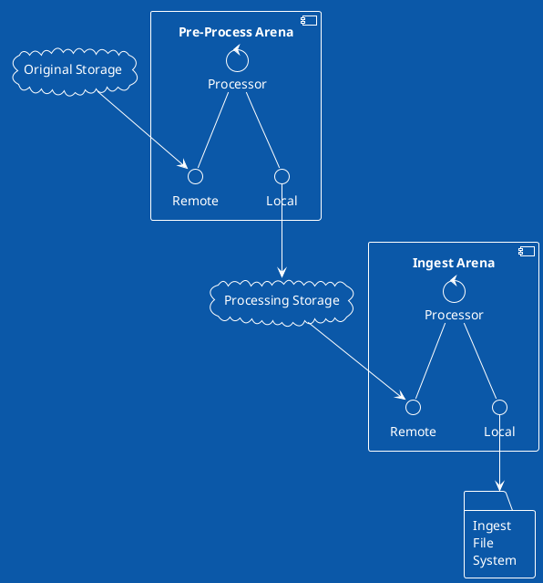
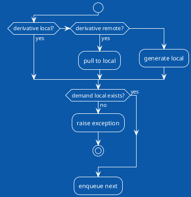
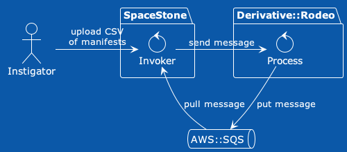
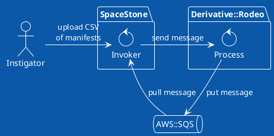
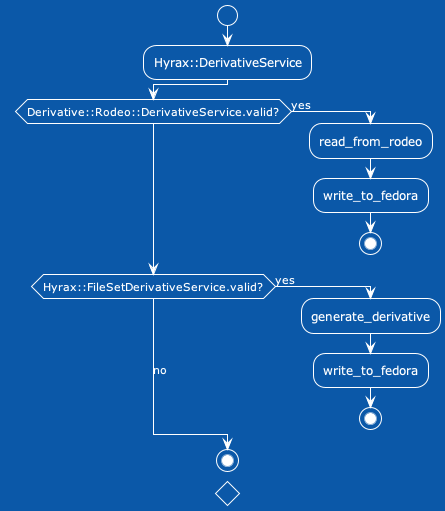
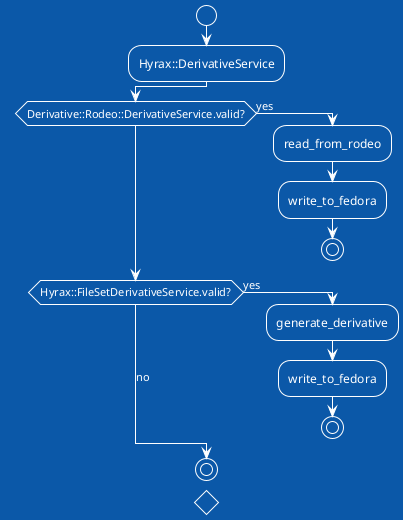

<!-- START doctoc generated TOC please keep comment here to allow auto update -->
<!-- DON'T EDIT THIS SECTION, INSTEAD RE-RUN doctoc TO UPDATE -->
**Table of Contents**  *generated with [DocToc](https://github.com/thlorenz/doctoc)*

- [Derivative::Rodeo](#derivativerodeo)
  - [Concepts](#concepts)
    - [Inflection Points](#inflection-points)
    - [Configuration](#configuration)
  - [Note on Development Status](#note-on-development-status)
  - [Design Goals](#design-goals)
  - [Diagrams](#diagrams)
    - [Conceptual Diagram](#conceptual-diagram)
    - [Process Diagram](#process-diagram)
    - [Interaction with SpaceStone](#interaction-with-spacestone)
    - [Interaction with Hyrax Ingest](#interaction-with-hyrax-ingest)
  - [Installation](#installation)
    - [Dependencies](#dependencies)
  - [Usage](#usage)
  - [Development](#development)
  - [Tasks](#tasks)
  - [Contributing](#contributing)

<!-- END doctoc generated TOC please keep comment here to allow auto update -->

# Derivative::Rodeo

Welcome to the rodeo!  The goal of `Derivative::Rodeo` is to provide interfaces and processing for files.

The fully public facing methods of `Derivative::Rodeo` are module methods on the [Derivative::Rodeo module](./lib/derivative/rodeo.rb).  There is an associated [Derivative::Rodeo spec file](./spec/derivative/rodeo_spec.rb) for those methods which is intended to be a place for "feature specs."

## Concepts

The conceptual logic of `Derivative::Rodeo` is:

- Use the file I have locally…
- Else pull to local the file from a remote source…
- Else generate a local version…
- Demand a local copy of the file and proceed to the next step.

The above is encoded in [Derivative::Rodeo::Process](./lib/derivative/rodeo/process.rb).

We start from a [Derivative::Rodeo::Manifest::PreProcess](./lib/derivative/rodeo/manifest/pre_process.rb), which is comprised of:

- a parent identifier
- an original filename
- a set of named derivatives; each named derivative might have path to a "known" already existing file.

We process the original manifest in an [Arena](./lib/derivative/rodeo/arena.rb).  During processing we might spawn multiple "child" processes from one derivative.  For example splitting a PDF into one image per page.  Each of those page images would then have their own [Derivative::Rodeo::Manifest::Derived](./lib/derivative/rodeo/manifest/derived.rb) for further processing.

### Inflection Points

There are inflection points that the `Derivative::Rodeo` considers:

1. Spawning processes based on the [MimeType step](./lib/derivative/rodeo/step/mime_type_step.rb)
2. Spawning processes to [split a PDF](./lib/derivative/rodeo/step/pdf_split_stepm.rb)

These inflection points conceptually start a new [Chain](./lib/derivative/rodeo/chain.rb) of processing.

*Musing: I write this here, wondering if those inflection points should call out to the public API of Derivative::Rodeo; that way providing a clearer separation of boundary and exposing the inflection as a valid invocation.*

### Configuration

There are two conceptual configuration points:

- [Derivative::Rodeo::Configuration](./lib/derivative/rodeo/configuration.rb) via the [Derivative::Rodeo.config](./lib/derivative/rodeo.rb) method.
- The individual classes in the Derivative::Rodeo namespace via [ActiveSupport's class_attribute](https://api.rubyonrails.org/classes/Class.html#method-i-class_attribute).

Let’s consider the following.

For one project I need to have two rodeos.  The first rodeo is for pre-processing.  The second rodeo is for ingesting the pre-processed files (see the [Conceptual Diagram](#conceptual-diagram) section).  The [storage](./lib/derivative/rodeo/storage_adapters) and [queue](./lib/derivative/rodeo/queue_adapters) adapters will be different.  For example, the pre-process local storage will likely be the ingest process’s remote storage.  Both rodeos will likely have the same required steps for processing.

For another project, I will again need two rodeos.  But I want different processing steps; for example I want to add steps to process a 3D model.  I might configure the mime type step to sniff out the files that go into a 3D model and then spawn a new step.

For a third project, I again need two rodeos, but then I want to use a different process to determine the file’s mime type; perhaps instead of leveraging the [Marcel gem](http://rubygems.org/gems/marcel), I leverage [Fits](http://fitstool.org) and some XML parsing.

In other words, there are some assumptive configurations about a given rodeo:

- What’s my logging
- What’s my starting step
- What’s my queue adapter
- What’s my storage adapters

And there’s other assumptions based on those decisions.  For an [AWS SQS Queue Adapter](./lib/derivative/rodeo/queue_adapters/aws_sqs_adapter.rb) we will likely need region information and even some low level credentials that might go in `ENV`.  For another cloud adapter those rules could be different.

Perhaps we know we’re always working with monochrome images, it’s unlikely we’d want to use the existing [Hocr step](./lib/derivative/rodeo/step/hocr_step.rb) as written.  We can assume that we have monochrome.

As I hope is evident, the `Derivative::Rodeo` is intended to provide a consistent interface for moving files and ensuring that the requried and desired derivatives are part of that move.  And for the `Derivative::Rodeo` to be something that we can incorporate into many projects and do minimum customization of those projects; instead relying on configuration and building towards interfaces.

*Note: The above describes an ideal state and there are identified chores to migrate configuration points to the more appropriate locations.*

## Note on Development Status

This is in active development and we're exploring the names and concepts as we build towards the technical requirements of several different projects.  What does that mean?  Look to the [Derivative::Rodeo](./lib/derivative/rodeo.rb) require section that has a large banner.  Those are the stable named concepts.  Below that level, things are somewhat in-flux; in particular regarding the [Derivative::Rodeo::Manifest](./lib/derivative/rodeo/manifest.rb) module. 

## Design Goals

`Derivative::Rodeo` is designed in such a way that it can run within an application or as part of a distributed architecture (e.g. AWS Lambdas).  Further, it is designed for extension and configuration; through well-documented interfaces and modular boundaries.

It is also designed to provide insight into configuration and failures through custom exceptions and logging.  It has a fail early mind set; first verifying that the desired derivatives don't create circular dependencies; flattening those dependencies into a chain which we process one link at a time, via [Derivative::Rodeo::Process](./lib/derivative/rodeo/process.rb).

Last, the test suite covers a significant portion of the code; exercising both unit tests and functional tests that can run on a developers machine to help ensure the desired behavior.

## Diagrams

- [Conceptual Diagram](#conceptual-diagram) :: The top-level concept of what the Derivative::Rodeo orchestrates.
- [Process Diagram](#process-diagram) :: The low-level diagram of how the [Derivative::Rodeo::Process](./lib/derivative/rodeo/process.rb) works.
- [Interaction with Spacestone](#interaction-with-spacestone) :: How the `Derivative::Rodeo` interacts with [SpaceStone](https://github.com/scientist-softserv/space_stone).
- [Interaction with Hyrax Ingest](#interaction-with-hyrax-ingest) :: Leverage the Hyrax::DerivativeService plugins to override the default behavior.

### Conceptual Diagram

“This ain’t my first rodeo.” (an idiomatic American slang for “I’m prepared for what comes next.”)

The `Derivative::Rodeo` orchestrates moving data from place to place; and ensuring that at each stage the requisite files exist.

The PlantUML Text for the Conceptual Diagram

### Process Diagram

This is the logical flow chart of the [Derivative::Rodeo::Process](./lib/derivative/rodeo/process.rb); it demonstrates the low-level processing task of a single derivative.

The PlantUML Text for the Process Diagram

### Interaction with SpaceStone

[SpaceStone](https://github.com/scientist-softserv/space_stone) is an AWS Lambda ecosystem that SoftServ has used in the preliminary work of pre-processing derivatives in a specific use-case.  The following diagram shows the conceptual interaction of the `Derivative::Rodeo` and `SpaceStone`.

The PlantUML Text for the Interaction with SpaceStone

### Interaction with Hyrax Ingest

[Hyrax](https://github.com/samvera/hyrax) exposes the concept of the [Hyrax::DerivativeService](https://github.com/samvera/hyrax/blob/426575a9065a5dd3b30f458f5589a0a705ad7be2/app/services/hyrax/derivative_service.rb); a configurable end-point.  Hyrax has a default service [Hyrax::FileSetDerivativesService](https://github.com/samvera/hyrax/blob/426575a9065a5dd3b30f458f5589a0a705ad7be2/app/services/hyrax/file_set_derivatives_service.rb) that assumes it will create all derivatives and then assign them to the FileSet.

In the [NewspaperWorks](https://github.com/samvera-labs/newspaper_works/) gem and [IIIF Print](https://github.com/scientist-softserv/iiif_print/) gem, the Samvera community introduced different derivative services; in part to expand on the default functionality.

One challenge of these implementations is that they assume that the ingest process simultaneously creates the derivative and assigns the derivative.

The [Newman Numismatic Portal](https://github.com/scientist-softserv/nnp/) introduced the idea of pre-processing the derivatives and splicing into the processes to circumvent some of the derivative generation.

With all of that here's the diagram for the Interaction with Hyrax Ingest.

The PlantUML Text for the Interaction with Hyrax Ingest

## Installation

Install the gem  and add to the application's Gemfile by executing:

    $ bundle add derivative-rodeo

If bundler is not being used to manage dependencies, install the gem by executing:

    $ gem install derivative-rodeo

### Dependencies

*The list of dependencies is not reflective of the current state.*

  * [Tesseract-ocr](https://github.com/tesseract-ocr/)
  * [LibreOffice](https://www.libreoffice.org/)
  * [ghostscript](https://www.ghostscript.com/)
  * [poppler-utils](https://poppler.freedesktop.org/)
  * [ImageMagick](https://github.com/ImageMagick/ImageMagick6)
    - _ImageMagick policy XML may need to be more permissive in both resources  and source media types allowed._
  * [libcurl3](https://packages.ubuntu.com/search?keywords=libcurl3)
  * [libgbm1](https://packages.debian.org/sid/libgbm1)

## Usage

TODO: Write usage instructions here

## Development

After checking out the repository, run `bin/setup` to install dependencies. You can also run `bin/console` for an interactive prompt that will allow you to experiment.

To install this gem onto your local machine, run `bundle exec rake install`. To release a new version, update the version number in `version.rb`,  and then run `bundle exec rake release`, which will create a git tag for the version, push git commits  and the created tag,  and push the `.gem` file to [rubygems.org](https://rubygems.org).

## Tasks

- [ ] Storage Adapters
  - [ ] Flesh out the FromManifest adapter for remote files
  - [ ] Add an AWS S3 Adapter; remembering that it could be used as either remote or local
- [x] Queue Adapters
   - [x] Add an AWS SQS Adapter (see https://github.com/scientist-softserv/space_stone)
- [ ] Step work
  - [ ] Does it make sense to include `fits`?  We’re gathering technical metadata for processing and eventual storage.
  - [ ] Video
  - [ ] Alto
  - [ ] Audio
  - [ ] Thumbnail
  - [ ] Text Extraction (Hydra Derivatives leverages SOLR’s text extraction; there’s `pdftext` to consider)
  - [ ] Tidy up the base derivative type; there are some more expressive methods I could adopt to reduce duplication (and introduction of errors).
  - [ ] What else?
- [ ] Manifest; I have refactored towards specific manifests and need to revisit existing manifests
  - [ ] Create methods for the prerequisites
  - [ ] Demand the prerequisites as part of the generate
- [ ] Work on PDF Splitting
  - [ ] In conversations with @orangewolf, we may want to OCR in batches instead of one file at a time
- [ ] Integrate Derivative::Rodeo into [IIIF Print](https://github.com/scientist-softserv/iiif_print/).
  - [ ] Assign “local” file to Fedora S3 location
- [ ] Process: At present the pre-process does not do anything with the locally demanded derivative
  - [ ] Ingest Process: Follows the same logic of [Derivative::Rodeo::Process](./lib/derivative/rodeo/process.rb), but moves derivative into FileSet.  Note because "original" is a derivative, we will need this processing at the [Derivative::Rodeo::Step](./lib/derivative/rodeo/step.rb) level

`Derivative::Rodeo` is positioned to be an alternate to [Hydra::Derivatives](https://github.com/samvera/hydra-derivatives).

## Contributing

Bug reports and pull requests are welcome on GitHub at https://github.com/scientist-softserv/derivative-rodeo.
